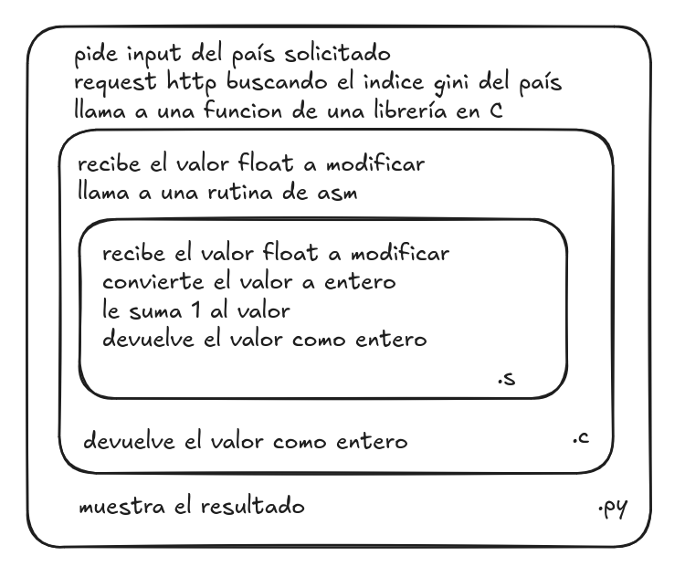
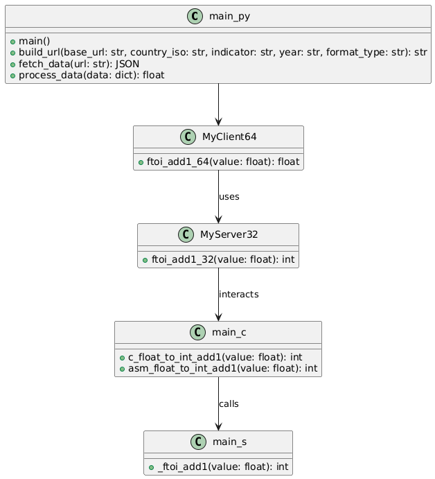
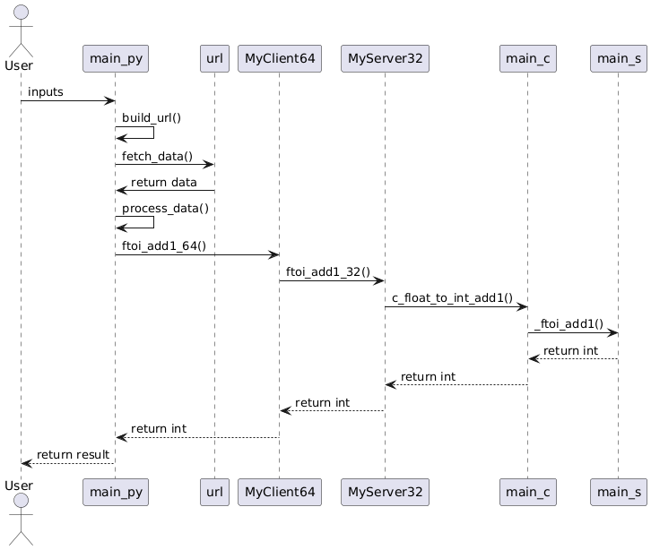
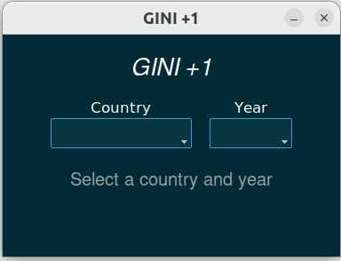
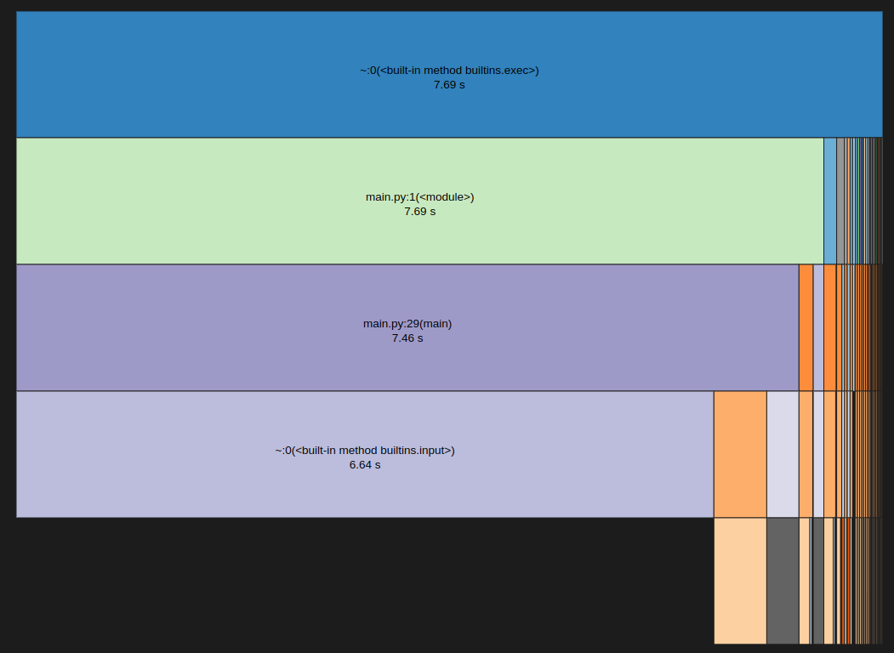
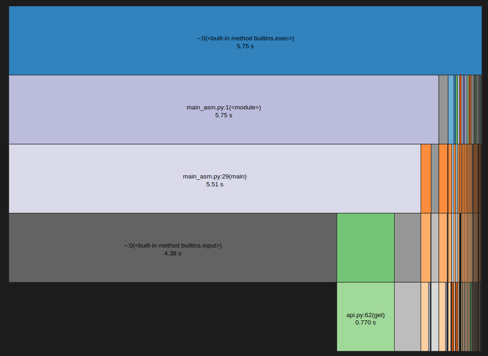

# Trabajo Práctico N°2: Stack Frame
## Cátedra de Sistemas de Computación, FCEFyN, UNC. 2025.

### Grupo: Los puntos flotantes
### Alumnos: Bernaus, Julieta; Di Pasquo, Franco; Viccini, Carlos Patricio.
### Profesor: Jorge, Javier.

## Introducción
En este informe, presentaremos un proyecto de software que utiliza software anidado en diferentes lenguajes y stack frame. Los lenguajes de programación utilizados en este desarrollo son Assembler, C y Python. Stack frame se refiere a una sección del stack dedicada a llamar a una función.

## Desarrollo

### Consigna
La consigna pedía lo siguiente:
- diseñar e implementar calculos en ensamblador,
- recuperar desde la capa superior información de una api REST,
- utilizar python, 
- entregar los datos de consulta a un programa en C que convocará rutinas en ensamblador para que hagan los cálculos de conversión y devuelvan los resultados a las capas superiores,
- mostrar los resultados en una capa superior,
- que la capa superior recuperase la información del banco mundial https://api.worldbank.org/v2/en/country/all/indicator/SI.POV.GINI?format=json&date=2011:2020&per_page=32500&page=1&country=%22Argentina%22,
- que se realicen cálculos de conversión de float a enteros y devuelva el índice de un país como Argentina u otro sumando uno (+1).

### Estructura del proyecto

A partir de la consigna, realizamos el siguiente diagrama para ilustrar el programa a realizar:
.

Este diagrama representa la responsabilidad de cada una de las capas.

Además, existe una interfaz gráfica desarrollada en python, que permite un acceso más fácil al programa.

### Diagramas del proyecto

El siguiente diagrama presenta las clases del proyecto:
.

Como se puede apreciar, introdujimos las capas MyClient64 y MiServer32 para salvar la incompatibilidad entre libs de 32bits y python de 64bits.

.

En el diagrama de secuencia se puede observar como las capas actúan de manera anidada.

### Interfaz

Como interfaz gráfica, incorporamos la siguiente, que permite elegir un país y año. Esta desarrollada usando la libreria de python ttkbootstrap, la cual es un wrapper de la famosa libreria tkinter y nos permite usar themes predefinidos.

### Time Profiling

#### Profiling en Python

A los fines de medir el rendimiento del programa sintetizado, se realizo profiling del programa principal en Python (utilizando la herramienta cProfile junto con snakeviz), y se comparó su rendimiento cuando la función de cálculo de conversión de float a entero fue implementada en C y en Ensamblador. 
La ejecución del programa con la función implementada directamente en C arrojo el siguiente diagrama:

.

Luego, al implementar el código de la función de cálculo utilizando lenguaje Ensamblador, se obtuvo el siguiente diagrama:

.

Se evidencia una notable mejora en el rendimiento del programa, reduciéndose el tiempo de ejecución del mismo en un 25,2%.

#### Profiling con mock de server en flask

Se creó un mock de servidor en Python utilizando flask, con la intención de medir el tiempo de respuesta de la API sin considerar demoras debidas a factores externos como la latencia de la conexión. Una vez compilado y corriendo, se conecta al servidor de mock en vez del real utilizando el comando USE_MOCK=true python3 mainUI.py, por ejemplo. Después de numerosas ejecuciones, el valor promedio obtenido es de 0.007 segundos. Esto representa una gran diferencia muy grande con lo observado en la figura 5, donde los tiempos que correspondían a api.py(get) eran de aproximadamente 0.770 segundos. Esta diferencia  podría corresponderse con tiempos razonables para una red doméstica inalámbrica.

#### Profiling de funciones en C

Luego, se realizo la misma comparación, pero esta vez en C, enfrentando únicamente a las funciones de cálculo. Esta segunda comparacion se realizó por método directo (usando la funcion clock()), y a traves de la herramienta gprof.

#### Función clock()

Para realizar el profiling con C de forma directa, se utiliza la función clock(). Se han seguido los siguientes pasos para obtener resultados aproximados:

1. Se crea un nuevo prof_main_med_Clock.c para poder modificar main.c para realizar el profiling.
2. Se crea un nuevo prof_main.s para poder modificar main.s para realizar el profiling. 
3. main.s daba un error de compatibilidad con gcc, por lo que se tradujo de NASM a GAS.
4. Se crea el archivo ensamblador .o para 32 bits.
5. Se compila enlazando el archivo ftoi_add1_32bits.o, y generando el ejecutable prof_main_med_Clock.
6. Luego, se ejecuta el ejecutable prof_main_med_Clock.

Se han obtenido los siguientes resultados:

- Tiempo de función con C: 0.000003 segundos.
- Tiempo de función con ASM: 0.000001 segundos.

Esto representa una pequeña diferencia en tiempos nominales, pero una diferencia muy significativa en comparación, ya que es casi 3 veces más en C que en ASM.

#### Gprof

Utilizando gprof, se realiza también un análisis, para el cual se siguen los siguientes pasos:
1. Se crea un nuevo prof_main_med_gprof.c para poder modificar main.c para realizar el profiling.
2. Se crea una función main simplificada, que llame iteradas veces (100.000.000 de veces) a cada funcion, debido a que son funciones muy rápidas
3. Se compila el programa con la opción -pg, que habilita la generación de datos de profiling, y -O0, para que no optimice el código, evitando posible simplicaciones.
4. Luego, se ejecuta el ejecutable prof_main_med_gprof.

A partir de gprof, se obtienen los siguientes resultados, que representan el tiempo dedicado a cada tarea.

| % Time | Cumulative Seconds | Self Seconds | Calls      | ns/Call (Self) | ns/Call (Total)  | Name                    |
|--------|--------------------|--------------|------------|----------------|------------------|-------------------------|
| 96.88  | 2.48               | 2.48         |            |                |                  | _ftoi_add1_32bits       |
| 1.56   | 2.52               | 0.04         |            |                |                  | main                    |
| 1.17   | 2.55               | 0.03         | 100,000,000| 3.00           | 6.00             | asm_float_to_int_add1   |
| 0.39   | 2.56               | 0.01         | 100,000,000| 1.00           | 1.00             | c_float_to_int_add1     |

## Conclusión

El principal problema con el que nos enfrentamos fue la incompatibilidad entre el trabajo en 64 bits de python y en 32 bits del programa de assembler. Sin embargo, la incorporación de la librería msl-loadlib nos permitió salvarlo, de manera tal que pudimos desarrollar el proyecto con todas sus capas interactuando como se deseaba.

Por el lado del profiling, pudimos observar una brecha muy grande entre el desempeño de las funciones al comparar los programas en C y en Assembler, tanto comparándolos desde C como desde Python. Esto es muy valioso porque aunque sabíamos en teoría que esto era una ventaja del Assembler, estamos acostumbrados a trabajar en su mayoría con hardware tan rápido y subutilizado que la diferencia no es notable.
